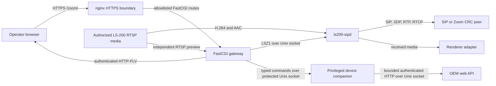
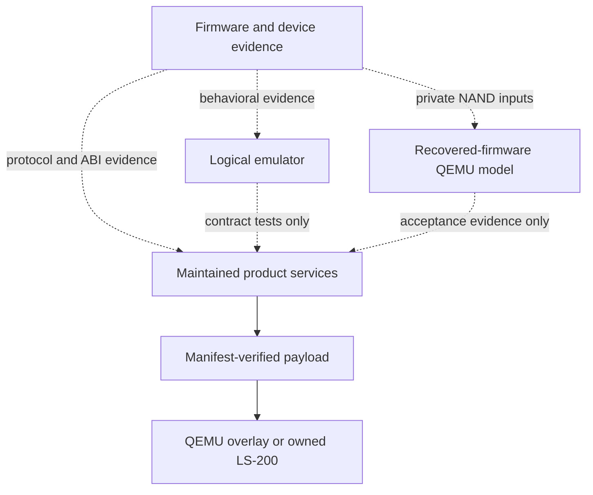

# Architecture

## Unified console device boundary

The maintained console now presents Room, Library, Schedule, and Settings.
`/zoom/` and the Zoom HTTP contract remain compatible; `/zoom/#legacy` retains
the previous Zoom screen organization. The OEM web entry point has not been
changed. The unified interface is not yet a complete device replacement.

A privileged C17 companion under `product/console/device/` owns the bounded
read-only OEM recorder projection. The gateway owns user authentication and
roles and connects to its fixed Unix socket, independently of LSZ1. The
companion reads the OEM API through its fixed local Unix socket with peer UID
checks and server-side credentials. OEM sessions stay in memory and renew only
on a definite authentication rejection, with bounded attempts and backoff. Product builds do not consume recovered
source. Its [contract and coverage](../product/console/device/README.md) specify
message bounds, deadlines, failure states, and the unresolved workflow limits.

The companion also owns a versioned, bounded journal in protected persistent
state outside release payloads, under the persistent deployment `device/` directory. It locks that state for its lifetime, preserves
idempotency results, and converts interrupted running jobs to uncertain on
startup. Revision-2 local queries expose correlated status and paginated job
projections while revision-1 status remains compatible. The journal is a C API
foundation; device dispatch adapters, operation-specific reconciliation, and
gateway/browser job workflows are not yet implemented. Administrator credential
replacement is a separate typed command with a revision-bound atomic credential
store and durable idempotency receipts. Incompatible state
prevents startup rather than resetting work. See the companion's
[recovery contract](../product/console/device/README.md#persistent-job-state-and-recovery).

SIPD remains authoritative for calls and SIP/media state. OEM configuration is
not copied into SIPD or mutated by this companion. No shared activity reservation
or device mutation is implemented; unknown state never authorizes disruption.
Library, schedule and OEM configuration are explicitly unavailable, and the
companion is included in payload inputs and service lifecycle. ARM release and
physical acceptance gates remain required.

## Scope

LS-200 Zoom combines a maintained endpoint and management console with two
independent development environments and a firmware-analysis corpus. The
product stack can be built and packaged without importing recovered or
decompiled firmware. The emulator and QEMU model provide different kinds of
evidence and neither is a production dependency.

## System overview

The product deployment starts the privileged device companion before the daemon,
gateway, and nginx. The companion runs as root; the other services retain their
separate unprivileged identities. The gateway is the only browser-facing
HTTP-to-control adapter. The daemon has no network control listener.

Dashed arrows are evidence relationships, not source or runtime dependencies.

## Components and dependency direction

### Native endpoint

[`product/sipd/`](../product/sipd/README.md) builds `ls200-sipd` and the
`ls200_sipd_core` static library. It owns strict configuration loading, typed
Zoom dial construction, SIP transactions, SDP negotiation, RTP/RTCP, optional
SRTP, local RTSP ingest, media adaptation, renderer gates, persistent runtime
settings, and the LSZ1 Unix-socket server.

The daemon's public C boundary is under `product/sipd/include/ls200_sipd/`.
PJSIP, libsrtp, FAAD2, and SpeexDSP are opt-in inputs supplied through explicit
CMake options. The default build does not download or discover them.

SDES negotiation accepts `AES_CM_128_HMAC_SHA1_80` and verifies the answer's
crypto tag against the offer. Optional key lifetimes remain private SDP state
and flow into the media and RTP implementation without changing the public
C or LSZ1 schemas. Each key direction has separate successful-packet counters
for RTP and RTCP, bounded by the declared lifetime and the suite's protocol
limits (`2^48` for RTP, `2^31` for RTCP). Reaching either counter's limit
exhausts that direction's key for both protocols. Exhausted keys fail closed before
another crypto operation; replayed or unauthenticated packets do not replenish
or consume the remaining receive budget. MKI and unsupported suites or session
parameters are rejected.

Negotiated payload numbers have separate transmit and receive mappings. The
public selected-codec fields describe transmit payloads; private SDP state
supplies receive payloads to RTP admission, clocks, DTMF, and rendering. An
offerer transmits with the answer's mapping and receives with its offer's
mapping. Unsupported answer formats with valid mappings remain unselected;
missing dynamic mappings, conflicting static mappings, and incompatible
selected codecs are rejected.

Active send-only streams still authenticate and process RTCP feedback.
PLI/FIR must target the local media SSRC and pass the existing rate limit;
inbound RTP is discarded without playout. Inactive streams remain skipped.
When committed media is released, the daemon writes numeric packet, rejection
and keyframe-request totals to its log without peer identifiers or payloads.
Early authenticated send-only RTCP reports also provide bounded numeric loss
and sequence diagnostics. Trusted in-dialog SIP INFO observations report only
bounded content-type/token classifications. Authenticated RFC 5168 full-picture
INFO requests use a private, dialog-bound adapter queue. A 200 response confirms
acceptance; the endpoint dispatches recovery after SIP polling, at most once per
second. The bounded parser accepts the unqualified full-picture XML structure
without general XML, entities, attributes or stream selection. Unsupported
backend keyframe results remain visible. Unsupported refresh preserves source
assembly and an established transmission; periodic IDRs continue to the peer.

The foreground loop caps idle waits at 20 ms and active-video service at 1 ms.
Queued RTP/DTMF, actionable receive playout and reorder-hold expiry can shorten
that deadline. Bounded RTP catch-up preserves cadence after scheduling jitter:
each poll sends at most four video packets and two audio packets. DTMF retains
strict spacing, as does the public queue dequeue API. RTSP UDP receive work is capped at eight datagrams per
channel per drain, preserving service for later channels.
RTP sockets request 256 KiB receive buffers to accommodate camera bursts without
changing system-wide limits or RTCP buffering.
The native source reorder path discards damaged partial H.264 assembly after
packet loss and preserves completed frames until consumed. Sequence jumps
beyond its bounded window resynchronize only after the jitter deadline.
Dependent H.264 frames are admitted after a valid IDR; damaged assembly,
parameter-set changes, reconnect and keyframe requests require a new IDR.
These recovery rules preserve codec/profile validation and allocation limits.
Session-scoped `GET_PARAMETER` requests refresh native RTSP streams according
to the advertised timeout, with a maximum ten-second interval and bounded
reply deadline. Exact response CSeq and session checks gate completion. Media
ingest continues while awaiting a refresh; failed refreshes use bounded
reconnect recovery without relaxing media validation.

H.264 admission checks the complete access unit against packet and byte limits,
stages payloads privately, and commits the batch only after every allocation
succeeds. Failed admission preserves queued backlog and packet sequence state.
The legacy `video_queue_frames` setting continues to count packets. RTP/RTCP
readiness can wake control waits; the private PJSIP adapter watches owned
duplicate sockets with one-byte asynchronous peeks. The existing receive path
still consumes and validates datagrams. Registration failure or an unsupported
adapter retains bounded polling; transmission cadence and receive deadlines
remain independent of readiness notifications.

Control connections use retained nonblocking slots, eight in the runtime
configuration with a supported maximum of 64. Each peer is authorized on accept
and receives a one-second absolute connection deadline. A poll accepts at most
one connection and services one ready client in rotating order; pending replies
remain bounded until delivery, expiry, or destruction.

### Management console

[`product/console/`](../product/console/README.md) has three layers:

1. the React application calls same-origin `/zoom/api/v1/*` routes and renders
   only server-provided state;
2. nginx terminates HTTPS, serves static UI assets, and forwards an explicit
   route allowlist to FastCGI; and
3. the C gateway enforces authentication, roles, Origin, CSRF, idempotency,
   persistence, response projection, and LSZ1 translation.

The gateway depends on the daemon's LSZ1 contract at runtime. Its preview core
reuses the daemon's maintained RTSP parser and H.264 depacketizer at build time,
but preview remains an independent connection and never traverses a SIP call.

Gateway transactions copy bounded request and principal state before daemon I/O.
A state mutex protects preparation and completion. Separate read and mutation
mutexes permit at most one read exchange and one mutation exchange concurrently;
mutations remain serialized. Admission rechecks session lifetime, account role,
credentials, and completed idempotency after waiting. Elapsed monotonic time is
added to the request timestamp at admission and completion. Logout or revocation
before admission prevents dispatch; an issued command can complete without
writing a revoked session or returning a stale cookie or diagnostics export.

Login consumes the existing authentication budgets and reserves one hashing slot
under the state mutex, then performs PBKDF2 outside that mutex. A busy hashing
slot returns the existing authentication rate-limit response. Account credentials
and revision are revalidated before session creation. Unknown accounts retain
the dummy hash path. Session cookies must be exact semicolon-delimited pairs;
duplicate session cookies are rejected.

Browser JSON attempts have a ten-second deadline covering fetch and body reads.
Protected mutations retain one retry with the same operation identifier; reads,
authentication, malformed responses, cancellation, and persistence uncertainty
never retry. Hidden or unmounted polling views abort obsolete reads; restoring
visibility refreshes once, and regular polling resumes five seconds after
completion. Visibility changes do not cancel mutations.

Calls and Media each reuse one status response per refresh through shared browser
projections. Calls also reads its gateway-owned collections. Both views read
authenticated preview metadata independently of call status. Diagnostics shows
current signaling separately from its bounded checks. An established call can
make the SIP-control check ready without registration, as direct CRC does not
register. This does not establish remote media reception.
A physical SIP service can select a headless receive monitor through the explicit
`LS200_SIPD_RECEIVE_MONITOR` executable path. Its target FFmpeg dependency must
be verified before use. The daemon owns two unprivileged decoder children,
bounded nonblocking input queues, health checks, and per-call cleanup. Incoming
H.264 access units retain all NALs through the RTP marker; damaged assembly or
queue overflow requests keyframe recovery. The monitor processes received media
locally and does not provide HDMI or speaker playback. Its frame counters mean
accepted input, not confirmed display output.

The browser distinguishes negotiated direction/security, shared source-frame
counts and receive counters from HDMI rendering. Idle defaults and unavailable
telemetry are not presented as negotiated media or measured health. Failed
refreshes mark the previous snapshot stale. Legacy projection routes remain available.
Production assets use `/zoom/`; fingerprinted JavaScript/CSS receive immutable
caching while HTML and unversioned resources retain `no-store`.

Admin-only `GET /zoom/api/v1/diagnostics/metrics` maps to read-only LSZ1 opcode
10. This on-demand response is separate from the exact revision-1 status schema.
Its revision-1 counters are integers from zero through 2147483647, with no
addresses, identifiers, credentials, or payloads. Stream queue/drop counters
reset with the media session; poll-lateness counters reset with the process.
The current shared backend counters appear in both stream records. Diagnostics
loads metrics only on request and isolates unavailable older-daemon responses.

### Logical emulator

[`lab/emulator/`](../lab/emulator/README.md) is a Python package for local
control, recovered-web compatibility, persisted fixture state, event delivery,
and guarded investigation tools. A shared `DeviceState` and JSON store back the
logical services; web authentication and lockout state are memory-only. An
optional pinned MediaMTX container and FFmpeg process provide synthetic
loopback media. Persisted mutations synchronously serialize the snapshot, fsync
the temporary file, atomically replace the snapshot, and fsync its parent
directory before acknowledgement. No deferred persistence mode is used.

The emulator models interfaces and state transitions. It does not execute the
recovered kernel, emulate TI hardware, or prove target timing or media fidelity.

### QEMU laboratory

[`lab/qemu/`](../lab/qemu/README.md) fetches and verifies a pinned QEMU source,
applies the maintained TI8168 machine changes, and boots private recovered NAND
inputs. The default run opens a recovered shell. Web mode adds copy-on-write
NAND and loopback-only user networking.
The EMAC receive model enforces RXMAXLEN on backend packet bytes, preserving
descriptor ownership when oversized frames are discarded and reporting OVERSIZE
when RXCEFEN permits a capped transfer. Synthetic checks exclude physical FCS
and wire-level parity.

The recovered web path and the maintained product overlay are separate modes.
The latter can exercise the packaged nginx, gateway, daemon, deterministic
peers, and fake renderers. It does not establish original M3/DSP/media behavior
or physical-device parity.

The oracle reader owns pinned file descriptors and reads only bounded offsets,
validating geometry and input identity around each read. COW erase initializes
untouched pages directly to erased bytes; programming still materializes backing
contents. The separate synthetic-only qtest runner generates its own main/OOB
fixtures and never loads recovered NAND files.

### Deployment and tooling

The physical autostart wrapper retains each startup attempt's output in a
root-only runtime log at `/run/ls200-zoom-autostart.log`. The next attempt
truncates the log; it is not persisted across reboots.

[`deployment/`](../deployment/README.md) assembles already-built binaries,
configuration templates, service scripts, and UI assets into a bounded payload.
It records hashes and modes. Trusted installer-side code verifies an independently
supplied manifest SHA-256 and the candidate contents, then rechecks the staged
release before activation. Candidate code cannot supply its own verification
authority. Versioned releases use an atomic selector and an ownership journal
for rollback and removal. Installed recovery helpers are staged and sealed before
atomic replacement. Both installers journal first-use gateway configuration and
its matching token against the verified release digest and service UID; retries
reconcile publication and ownership records before the same-version check.
Removal blocks while bootstrap recovery is unresolved. Cron setup completes before release activation; failed service
startup attempts reverse cleanup of every service and the runtime mount.
Build completion revalidates reviewed inputs and the maintained-source SHA-256
captured before building. Packaging and local gates reject a missing or changed
source digest. Packaging also compares every copied binary and UI asset with
the build receipt before publishing a package receipt.

`tooling/quality` defines the maintained-source gate. `tooling/live` binds a
reviewed build receipt, package, private session, and action-specific
confirmations to physical-device campaigns. A live session supplies the
private target and exact same-subnet host, while the campaign pins the approved
interface, SSH port, MAC, and host key for every contact. Local gate receipts bind
the tracked maintained product, lab, dependency, and verification tooling source
that `make verify` exercises, excluding the untracked evidence research corpus.
The ordered private-lab campaign starts the inert A release during smoke,
returns to A after testing B installation, then selects B and enables autostart
for the separately authorized reboot phase. Removal validates its saved
restoration baseline before contacting the target.
`tooling/device-evidence` publishes create-new, mode-0600 evidence below `.work`
or ignored `evidence/private`. These tools may
consume product or lab artifacts; product services do not depend on them.

The physical target profile publishes initial private-lab configuration and
TLS state through its compatible `private-lab-v1` transaction. Later TLS-only
replacement uses a separate stopped-service transaction that preserves the SIP
configuration, runtime settings, and console accounts while validating the old
and new certificate/key hashes against the root-owned ownership journal.
Zoom direct requires a separately provisioned SIP TLS trust bundle and required
SRTP in the static configuration; the console's runtime profile setting cannot
create this baseline. The optional owned `tls/sip-ca.crt` bundle is exposed to
the SIP service through the existing `/run/ls200-zoom-state` bind mount and is
covered by removal's ownership and digest checks. It is independent of the
HTTPS server certificate used by the console.
An optional static `sip.crc_address` selects a regional public IPv4 connector for
Direct CRC on TLS port 5061. Omission preserves normal DNS routing. The opaque
configuration stores this field and passes it through a private native-driver
entrypoint, preserving public C structures and the LSZ1 schema. SIP and TLS retain
the `zoomcrc.com` hostname independently of the authorized numeric socket.
Service-reported Contact and Route destinations retain their normal validation.
The field requires direct/public/TLS/required-SRTP configuration; it is not a
runtime console setting. Older binaries require removal of the optional key
before rollback.

The root service launcher reads DHCP nameservers before dropping privileges and
passes a bounded IPv4 list to the SIP process. On the physical glibc target,
the daemon initializes the system resolver from that list because the vendor
resolver file is behind root-only directories. DNS resolution still uses
`getaddrinfo`, followed by the existing resolved-peer authorization checks.
Converting an authorized numeric peer into a PJLIB socket address preserves
the address's text length and does not invoke hostname resolution again.
Reauthorization accepts a pinned peer anywhere in the current DNS answer set,
while preserving exact address, port, transport, and scope checks.
Instrumented native originate failures emit fixed stage labels and numeric
error codes to standard error, without SIP destinations or credential
material; the public LSZ1 error schema remains unchanged.
Failed installer activation can restore the verified prior selector while
leaving services stopped. Its recovery result is reported separately from
normal startup and health verification; a failed first installation instead
deactivates its selector.

The quality manifest covers maintained source and extensionless scripts across
these boundaries, with explicit exclusions for generated and recovered material.
Aggregate verification shares quality and deployment prerequisites. Console
commands share dependency leases; installation and cleanup require exclusive
access, and transitive compiler dependencies determine gateway object rebuilds.

## Principal runtime flows

### Console control request

1. The browser sends a same-origin request to an allowlisted API route.
2. nginx maps the request to the FastCGI process and supplies the remote-client
   identity for rate limiting and the local connection address and port.
3. The gateway validates the schema and authorization boundary. Mutations also
   require Origin, CSRF, and a request-bound idempotency key. The optional
   `allowed_origin: "device"` policy derives the exact HTTPS origin from nginx's
   local address and port on each request, supporting DHCP without accepting
   arbitrary browser-supplied hostnames. Fixed HTTPS origins remain supported.
4. The gateway converts supported operations to bounded LSZ1 messages.
5. `ls200-sipd` authenticates the gateway's Unix peer UID, executes the typed
   operation, and returns an opcode-specific safe response.
6. The gateway validates and projects the response before returning JSON.

Raw SIP destinations, executable names, filesystem paths, environment strings,
and arbitrary diagnostics are not accepted through HTTP.

### Call and media

The daemon constructs a destination from an approved profile and typed meeting
fields, then delegates SIP transport and transaction behavior to the configured
adapter. Negotiated media owns its bound RTP/RTCP sockets until session release.
Outbound video and audio originate from the selected bounded backend. Inbound
media passes through validation, jitter/depacketization, and renderer capability
gates.

An automatic retry that cannot prepare its next invite terminates the call,
retains the preparation error, and clears its retry deadline. The control
service remains available for a new operator call. Infrastructure errors from
SIP polling, clocks, or unexpected call-state transitions still propagate.

Public Zoom profiles require TLS-shaped configuration and protected media. The
inert private-lab example deliberately uses plaintext compatibility and may be
used only on an isolated authorized link.

For native RTSP input, a bounded temporary stream supplies the source SPS before
the SIP offer is built. The daemon advertises the observed H.264 profile and
rechecks the call stream against it before transmitting. Matching allows RFC
6184 equivalent subprofile representations at the same level; it does not
change the encoded video. The preflight retains codec metadata, not media
payloads.

Initial outbound Zoom Direct CRC answers may use send/receive for both media
sections despite a send-only offer. A private interoperability policy tolerates
that specific peer deviation from RFC 3264 while retaining send-only permissions
on the LS200. The actual remote direction remains visible internally. Other
profiles and direction mismatches use strict negotiation; the exception does
not grant receive or rendering capability or relax media authentication.

For TLS Direct CRC calls requiring SRTP, the authenticated SIP answer can name
a different unicast IPv4 media host and nonzero RTP/RTCP ports. The media policy
applies network-scope restrictions without a provider-specific address list.
An explicit operator authorizer still takes precedence. This separates the
service-reported media route from the independently validated SIP transport peer.
Other profiles retain their existing media-target rules.

The maintained fake renderer proves the bounded receive contract in host and
QEMU fixtures. The target AREC renderer factory currently returns unsupported,
so this source tree does not yet provide device audio/display output.

### Local preview

The gateway reserves a single preview lease, connects to one fixed operator
policy target, reads H.264 over RTSP/TCP, and emits FLV without transcoding. It
waits for decoder-ready video before sending a successful HTTP response.
Authentication, policy, sockets, deadlines, and cancellation remain gateway
responsibilities; the preview core retains none of them.

## State ownership

| State | Owner | Persistence |
| --- | --- | --- |
| Call, negotiation, media, events, runtime-settings revision | `ls200-sipd` | Memory plus optional owner-only runtime-settings file |
| Console accounts, directory, safe recents | Gateway | Owner-only atomic store |
| Sessions, CSRF values, token grace, idempotency cache, preview lease | Gateway | Memory only |
| TLS keys, SIP credentials, product configuration | Operator/deployment | External restrictive files; never repository content |
| Logical device state | Emulator | Explicit JSON state file below `.work/` |
| Emulator web sessions and lockout state | Emulator web server | Memory only |
| Installed releases and ownership journal | Deployment target | Versioned target state |
| Build, test, package, receipt, and campaign output | Tooling | Ignored `.work/` |

The daemon commits runtime settings with a synced mode-`0600` temporary file and
atomic rename. Rename is the commit point: the new settings and revision become
authoritative even if parent-directory synchronization fails. That failure returns
`PERSISTENCE_UNCERTAIN`; the gateway caches the corresponding HTTP 503 for the
operation identifier. Failures before rename retain the previous settings.

Settings expose daemon-derived TLS transport policy as `required` or
`not_required`. Certificate verification is shown as “Not observed.” Legacy
mutation and persisted `verified` fields remain readable for compatibility but
cannot establish certificate verification. Current clients omit the TLS mutation
field. Live certificate telemetry is outside this interface.

## Repository and data boundaries

The canonical visible roots are `product`, `lab`, `deployment`, `dependencies`,
`evidence`, `tooling`, and `docs`. The machine-readable layout policy is
[`tooling/quality/layout-policy.json`](../tooling/quality/layout-policy.json).

- `.work/` is the only generated build/cache/distribution/report root.
- `evidence/private/` holds complete firmware, dumps, extracted filesystems,
  credentials, keys, raw captures, and authenticated evidence. Its contents are
  ignored; only the policy README is versioned.
- `evidence/archive/` and subtree archives preserve historical non-runtime
  material that no active command should consume.
- `evidence/firmware-analysis/` contains sanitized findings and reproducibility
  records. Decompiled and reconstructed files are evidence, not maintained
  source or dependency candidates. Maintained analysis generators read retained
  evidence and write fresh results below `.work/firmware-analysis/`; check-only
  commands compare retained baselines without rewriting them. Archival tooling
  stages new archives below `.work/archive/`. Ghidra dry runs neither invoke
  Ghidra nor create output directories; failed analysis blocks successful
  completion and cleanup. Default and overridden output roots receive the same
  path validation. Application generators validate before publication and retain
  one another's hash entries; kernel inventories reject incomplete current input
  sets instead of mixing them with retained runs.

## Security boundaries

The maintained console provides HTTPS, strict route allowlisting, role-based
authorization, server-side sessions, exact Origin and CSRF checks, mutation
idempotency, bounded schemas, and safe response projection. The gateway and
daemon mutually constrain their Unix-socket peer identities. Product
configuration is descriptor-validated and uses secret-file indirection.

These controls do not repair the recovered vendor management application. The
tested firmware has a confirmed authenticated command-injection vulnerability;
the management plane must remain isolated. See [`SECURITY.md`](SECURITY.md) and
the daemon [threat model](../product/sipd/docs/governance/threat-model.md).

## Invariants and non-goals

- No product runtime dependency may point into recovered, decompiled, archived,
  generated, or private evidence.
- No HTTP route may accept raw SIP destinations, commands, executable paths, or
  arbitrary target addresses.
- Builds and deployment consume explicit reviewed local inputs and never write
  into recovered evidence.
- Removal preserves unowned or unverifiable target state and fails closed.
- QEMU and emulator results must remain labeled as model or fixture evidence.
- This repository does not implement H.323, a Zoom client/SDK, calendaring,
  room provisioning, content sharing, complete appliance emulation, or a
  firmware replacement.

The quality tooling has a separate QEMU model lane that materializes the reviewed
patch stack under `.work` and measures only owned machine sources and tests.
Its optional native build consumes explicit local inputs and runs synthetic
qtests. Baseline host verification remains separate from native-dependency and
rebuilt-model verification.

Deployment entrypoints share strict nginx and transaction record parsers through
packaged sibling helpers. The physical profile journals its root-owned helper
before installing callers and retains it through removal recovery. Entry points
continue to own locks, path checks, mutation ordering, and recovery decisions.

Physical release verification uses an installer-owned verifier outside release
directories and one independently supplied manifest digest per journaled release.
Packaging consumes the builder receipt; activation, rollback, cleanup service
stops, and reboot validation consume the journal record. Legacy digestless
releases fail closed until recovered through the authorized maintenance workflow
with an independent build receipt. Candidate code never establishes its own
verification authority. The nginx ARM lane verifies reviewed source inputs and
builds a separate copy beneath `.work`, preserving the input tree.

Host campaign phases hold a per-session lock through evidence and journal
publication. Reboot fingerprint confirmation precedes the new SSH connection.
Live UI builds use the prepared locked console cache and can name a hash-reviewed
host Node executable in the build manifest; they do not acquire dependencies.
Owned-device uploads require explicit RFC1918 IPv4 bind and source addresses,
an exact source match, and a nonempty bounded body. They publish through pinned
directory descriptors.

QEMU preparation and builds compare the full patched worktree against an
isolated expected index before configuration. Firmware analysis validates live
userland inputs against recorded hashes before classification and refreshes
derived evidence on each report. Kernel `modules.order` contributes build-order
observations, not runtime dependency claims.

The physical deployment profile selects the firmware FFmpeg executable for the
SIP daemon's bounded headless receive workers. This is an explicit physical
runtime dependency, separate from the host and emulator lanes, and does not
claim local video display or audio playback.

Video feedback is negotiated per selected H.264 payload. The media session
validates authenticated RTCP compounds and source identity before processing
NACK, PLI, or FIR. RTP owns the bounded cache of original protected packets and
invalidates it on target or key changes. Retransmissions update sender packet
and octet counts without advancing the source timestamp or re-protecting SRTP.
TMMBR parsing records a request only: no live OEM encoder control or applied
bitrate claim is implied, and unsupported TMMBR is not advertised.
