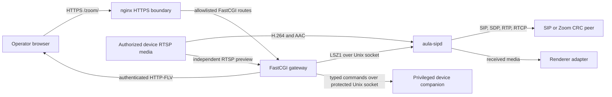

# Architecture

## Purpose and non-goals

Aula, a SIP endpoint for TI8168 media boards, combines a maintained
SIP/media endpoint and management console with two independent development environments and a
physical-target deployment lane. The product stack builds and packages without importing recovered
or decompiled firmware. The emulator and QEMU model provide different kinds of
development evidence and neither is a production dependency.

The hardware discussion uses a TI8168 media board as a
design reference. Comparisons include the TI DM8168 EVM, Z3-DM8168-RPS, and
iWave DM8168 Qseven SOM, covering evaluation boards and module/carrier designs.
They do not establish a manufacturing relationship or equivalent wiring,
boot configuration, or media behavior for any particular appliance. See
[board concept and comparison](reference/ti8168-board.md).

This repository does not implement H.323, a Zoom client/SDK, calendaring,
room provisioning, content sharing, complete appliance emulation, or a
firmware replacement. Host fixtures, logical emulation, and QEMU results do
not establish physical hardware, vendor-media, trusted TLS, public-network,
or Zoom acceptance.

## System overview

The product deployment starts the privileged device companion before the
daemon, gateway, and nginx. The companion runs as root; the other services
retain their separate unprivileged identities. The gateway is the only
browser-facing HTTP-to-control adapter. The daemon has no network control
listener.

## Components

| Path | Responsibility | Owned state | Depends on |
| --- | --- | --- | --- |
| [`product/sipd/`](../product/sipd/README.md) | SIP/SDP, RTP/RTCP, media, and the LSZ1 control server | Call/negotiation/media/event state; persisted runtime settings | Optional PJSIP, libsrtp, FAAD2, SpeexDSP; authorized RTSP source; renderer adapter |
| [`product/console/gateway/`](../product/console/gateway/README.md) | HTTP authentication, authorization, sessions, idempotency, response projection, LSZ1 translation | Account/directory/recents store; sessions, CSRF, idempotency cache, preview lease (memory only) | `aula-sipd` LSZ1 socket; device companion socket |
| [`product/console/device/`](../product/console/device/README.md) | Protected projected status, durable job journal, and credential state | Job journal and credential store (persistent deployment state) | Gateway over protected Unix socket; no firmware access |
| [`product/console/web/`](../product/console/README.md) | React/TypeScript browser application | None (renders server-provided state) | Gateway `/zoom/api/v1/*` routes |
| `product/console/nginx/` | TLS termination, static assets, FastCGI route allowlist | None | Gateway FastCGI process |
| [`lab/emulator/`](../lab/emulator/README.md) | Synthetic local recording/stream state and events | Explicit JSON state file below `.work/` | Independent validation lane; not a product runtime dependency |
| [`lab/qemu/`](../lab/qemu/README.md) | Synthetic TI8168 media-board model | Volatile guest state only | Caller-supplied reviewed ELF/raw image; independent validation lane |
| [`lab/sip-peer/`](../lab/sip-peer/README.md) | Deterministic SIP/RTP peer for controlled QEMU and physical-lab use | None | Used by QEMU and `tooling/live` |
| [`deployment/`](../deployment/README.md) | Payload assembly and physical-target lifecycle | Installed releases and ownership journals (target state) | Reviewed prebuilt binaries |
| [`dependencies/`](../dependencies/README.md) | Third-party version pins, advisories, and preparation scripts | Immutable dependency records | None |
| `tooling/console/` | Console dependency installation and lease management | Ignored `.work/` dependency state | Reads console manifests; product services do not depend on it |
| [`tooling/live/`](../tooling/live/README.md) | Physical-lab build and campaign orchestration | Ignored `.work/` build and session state | Reads product and deployment source; product services do not depend on it |

## Dependency direction

- Browser -> nginx -> FastCGI gateway -> LSZ1 Unix socket -> `aula-sipd` ->
  SIP/media integrations.
- Gateway -> typed commands over a protected Unix socket -> privileged device
  companion. The default companion reports unknown activity and makes no
  firmware call. This is independent of LSZ1; the companion owns no SIP or media state.
- The daemon has no RS-232 observation bridge. Its former public bridge header
  and implementation were removed; LSZ1 call operations remain available.
- `lab/emulator` and `lab/qemu` are independent validation lanes, not runtime
  dependencies of the product services.
- The maintained physical [campaign CLI](../tooling/live/README.md) rejects all
  actions before session loading or transport; hardware campaigns require
  separately reviewed private identity tooling. Physical packaging retains
  private provisioning prerequisites outside synthetic validation.
- `deployment` consumes reviewed prebuilt product binaries; it does not build
  them.
- Recovered, extracted, decompiled, archived, and private evidence is not
  maintained application code. Product code must not import or link it.
- No product runtime dependency may point into recovered, decompiled,
  archived, generated, or private evidence.
- No HTTP route may accept raw SIP destinations, commands, executable paths,
  or arbitrary target addresses.

## External contracts

| Contract | Defined at |
| --- | --- |
| LSZ1 wire protocol (opcodes, framing, gateway/companion peer-UID auth) | [`product/sipd/include/aula_sipd/control_protocol.h`](../product/sipd/include/aula_sipd/control_protocol.h) |
| HTTP `/zoom/api/v1/*` routes and the `{"revision":1,"ok":...,"data"|"error":...}` envelope | [`product/console/gateway/gateway.c`](../product/console/gateway/gateway.c) route table; documented in [`gateway/README.md`](../product/console/gateway/README.md) |
| Device-protocol revisions 1 (status) and 2 (correlated job queries, credentials) | [`product/console/device/wire.c`](../product/console/device/wire.c), `client.c`/`server.c` |
| `aula-sipd` config grammar | [`product/sipd/src/core/config_parse.c`](../product/sipd/src/core/config_parse.c); reference in [`configuration-reference.md`](../product/sipd/docs/operator/configuration-reference.md) |
| Gateway `gateway.conf` JSON policy | [`product/console/gateway/gateway_account.c`](../product/console/gateway/gateway_account.c) |
| Accounts store revisions 1-3 | [`product/console/gateway/gateway_account_store.c`](../product/console/gateway/gateway_account_store.c), `gateway_store.c` |
| Daemon persisted runtime settings | [`product/sipd/src/core/config_persistence.c`](../product/sipd/src/core/config_persistence.c) |
| Device journal (`jobs.json`) and credential store (`oem-credentials.json`) | [`product/console/device/jobs.c`](../product/console/device/jobs.c), `credentials_store.c` |
| Payload manifest and `payload-manifest.sha256` | [`deployment/payload/build-payload.py`](../deployment/payload/build-payload.py) |
| On-device paths and the retained `managed-by=open-ls200-root-shell.sh` marker | [`deployment/targets/ti8168/install.sh`](../deployment/targets/ti8168/install.sh), [`remove.sh`](../deployment/targets/ti8168/remove.sh) |
| Makefile operator targets (`make verify`, `live-*`, `qemu-*`, `package-*`) | [`Makefile`](../Makefile); described in [`DEVELOPMENT.md`](DEVELOPMENT.md) |

Preserve these contracts and the public C headers under
`product/sipd/include/aula_sipd/` unless an intentional migration is part of
the change and includes a deliberate compatibility plan.

## State ownership

| State | Owner | Persistence |
| --- | --- | --- |
| Call, negotiation, media, events, runtime-settings revision | `aula-sipd` | Memory plus optional owner-only runtime-settings file |
| Console accounts, directory, safe recents | Gateway | Owner-only atomic store |
| Sessions, CSRF values, token grace, idempotency cache, preview lease | Gateway | Memory only |
| Device job journal, device credentials | Device companion | Owner-only atomic store below persistent deployment state |
| TLS keys, SIP credentials, product configuration | Operator/deployment | External restrictive files; never repository content |
| Synthetic recording/stream state | Emulator | Explicit JSON state file below `.work/` |
| Installed releases and ownership journal | Deployment target | Versioned target state |
| Build, package, receipt, and campaign output | Tooling | Ignored `.work/` |

The daemon commits runtime settings with a synced mode-`0600` temporary file and
atomic rename. Rename is the commit point: the new settings and revision become
authoritative even if parent-directory synchronization fails. That failure returns
`PERSISTENCE_UNCERTAIN`; the gateway caches the corresponding HTTP 503 for the
operation identifier. Failures before rename retain the previous settings.

Settings expose daemon-derived TLS transport policy as `required` or
`not_required`. Certificate verification is shown as "Not observed." Legacy
mutation and persisted `verified` fields remain readable for compatibility but
cannot establish certificate verification. Current clients omit the TLS mutation
field. Live certificate telemetry is outside this interface.

The device companion's job journal and credential store follow the same
synced-temporary-file-and-atomic-rename discipline; see
[`product/console/device/README.md`](../product/console/device/README.md) for
its recovery states.

## Principal runtime flows

### Console control request

1. The browser sends a same-origin request to an allowlisted API route.
2. nginx maps the request to the FastCGI process and supplies the remote-client
   identity for rate limiting and the local connection address and port.
3. The gateway validates the schema and authorization boundary. Mutations also
   require Origin, CSRF, and a request-bound idempotency key. The optional
   `allowed_origin: "device"` policy derives the exact HTTPS origin from nginx's
   local address and port on each request, supporting DHCP without accepting
   arbitrary browser-supplied hostnames. Fixed HTTPS origins remain supported.
4. The gateway converts supported operations to bounded LSZ1 messages.
5. `aula-sipd` authenticates the gateway's Unix peer UID, executes the typed
   operation, and returns an opcode-specific safe response.
6. The gateway validates and projects the response before returning JSON.

Raw SIP destinations, executable names, filesystem paths, environment strings,
and arbitrary diagnostics are not accepted through HTTP. See
[`gateway/README.md`](../product/console/gateway/README.md) for the mutex,
admission, login, and retry rules that implement this boundary.

### Call and media

The daemon constructs a destination from an approved profile and typed
meeting fields, then delegates SIP transport and transaction behavior to the
configured adapter. Negotiated media owns its bound RTP/RTCP sockets until
session release. Outbound video and audio originate from the selected
bounded backend. Inbound media passes through validation, jitter/
depacketization, and renderer capability gates. Public Zoom profiles require
TLS-shaped configuration and protected media. The inert private-lab example
deliberately uses plaintext compatibility and may be used only on an
isolated authorized link. See
[`product/sipd/README.md`](../product/sipd/README.md) for SDES/SRTP,
payload-mapping, RTCP feedback, RTSP admission, and Zoom Direct CRC
interoperability detail.

The maintained fake renderer exercises the bounded receive contract in
synthetic environments. The target renderer factory currently returns
unsupported, so this source tree does not yet provide device audio/display
output.

### Device companion status and job workflow

`GET /zoom/api/v1/device/status` runs in the gateway's read lane, independent
of SIPD mutations, and exchanges one bounded revision-1 message with the
companion over its own Unix socket. Revision-2 correlated job queries and
credential replacement are implemented at the protocol level; device dispatch
adapters and browser job workflows are not yet connected. See
[`product/console/device/README.md`](../product/console/device/README.md) for
the journal's recovery states and the credential-replacement transaction.

### Local preview

The gateway reserves a single preview lease, connects to one fixed operator
policy target, reads H.264 over RTSP/TCP, and emits FLV without transcoding. It
waits for decoder-ready video before sending a successful HTTP response.
Authentication, policy, sockets, deadlines, and cancellation remain gateway
responsibilities; the preview core retains none of them. Preview reuses the
daemon's maintained RTSP parser and H.264 depacketizer at build time, but it
is an independent connection that never traverses a SIP call.

### Deployment: build, stage, install

`deployment/` assembles reviewed prebuilt binaries into a manifest-verified
payload. The maintained target installer and remover operate on an owned
physical target with separate authorization and recovery checks. The synthetic
QEMU model has no product payload overlay or acceptance workflow; see
[`deployment/README.md`](../deployment/README.md).
The name and installation-path migration is documented in the
[Aula upgrade guide](operator/upgrade-to-aula.md).

## Repository and data boundaries

The canonical visible roots are `product`, `lab`, `deployment`, `dependencies`,
`tooling`, and `docs`.

- `.work/` is the only generated build/cache/distribution/report root.
- Recovered firmware, dumps, extracted filesystems, credentials, keys, raw
  captures, authenticated session material, and private lab payloads are not
  repository content or product dependencies.
- Reviewed external inputs may be supplied explicitly to build and deployment
  tools; generated output still belongs below `.work/`.

## Security boundaries

The maintained console provides HTTPS, strict route allowlisting, role-based
authorization, server-side sessions, exact Origin and CSRF checks, mutation
idempotency, bounded schemas, and safe response projection. The gateway and
daemon mutually constrain their Unix-socket peer identities. Product
configuration is descriptor-validated and uses secret-file indirection.

These controls do not cover inherited firmware or its management plane. Keep
that plane isolated from untrusted networks. See [`SECURITY.md`](SECURITY.md) and
the daemon [threat model](../product/sipd/docs/governance/threat-model.md).

Physical deployment entrypoints share a strict transaction-record parser;
entry points own locks, path checks,
mutation ordering, and recovery decisions. Physical release verification uses
an installer-owned verifier outside release directories and one
independently supplied manifest digest per journaled release; candidate code
never establishes its own verification authority. See
[`deployment/README.md`](../deployment/README.md) and
[`deployment/targets/ti8168/README.md`](../deployment/targets/ti8168/README.md)
for the full journal, transaction, and recovery contract.

## Build lanes

| Lane | Command | Scope |
| --- | --- | --- |
| Default host | `make verify` | Builds the SIP daemon, device companion, and UI, then queries the synthetic emulator |
| QEMU model | `make qemu-verify` | Prepares and builds the pinned QEMU model, then runs its structural and model probes |
| Physical package | `make package-ti8168 ...` | Assembles explicit reviewed binaries and support files into a manifest-verified payload |

Emulator and QEMU results are synthetic model evidence; label them as such.
See [`DEVELOPMENT.md`](DEVELOPMENT.md) for commands and prerequisites.

## Where new code belongs

- SIP, SDP, RTP/RTCP, media, and LSZ1 server changes belong in
  `product/sipd/`. Preserve the public C headers and the LSZ1 schema.
- HTTP route, authentication, session, and LSZ1-client changes belong in
  `product/console/gateway/`. New routes need a schema, role, and the
  standard response envelope.
- Browser UI changes belong in `product/console/web/`.
- Projected status, job-journal, and credential changes belong in
  `product/console/device/`; this component must not gain SIP, media, or
  Zoom-facing responsibility.
- Synthetic local-state changes for host-only validation belong
  in `lab/emulator/`.
- Synthetic machine-model changes belong in `lab/qemu/`; keep model claims
  separate from physical-device claims.
- Deterministic SIP/RTP peer changes belong in `lab/sip-peer/`; QEMU and
  physical-lab callers use it.
- Payload assembly and install/rollback/removal logic belong in
  `deployment/`; the physical-target ownership and recovery checks stay
  independent of the synthetic QEMU model.
- Console dependency or live-campaign tooling belongs under
  `tooling/`; product code must never depend on it at runtime.
