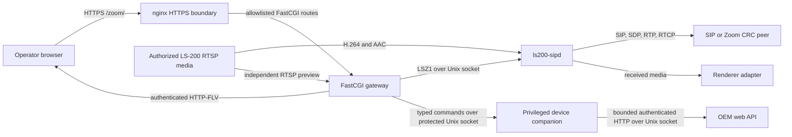
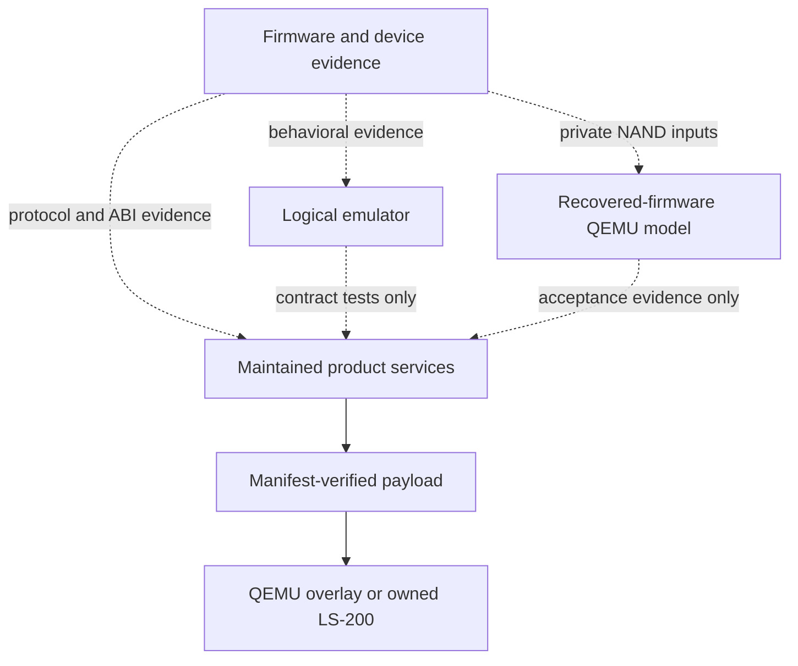

# Architecture

## Purpose and non-goals

LS-200 Zoom combines a maintained SIP/media endpoint and management console
with two independent development environments and a firmware-evidence
corpus. The product stack builds and packages without importing recovered or
decompiled firmware. The emulator and QEMU model provide different kinds of
validation evidence and neither is a production dependency.

This repository does not implement H.323, a Zoom client/SDK, calendaring,
room provisioning, content sharing, complete appliance emulation, or a
firmware replacement. Host fixtures, logical emulation, and QEMU results do
not establish physical hardware, vendor-media, trusted TLS, public-network,
or Zoom acceptance.

## System overview

The product deployment starts the privileged device companion before the
daemon, gateway, and nginx. The companion runs as root; the other services
retain their separate unprivileged identities. The gateway is the only
browser-facing HTTP-to-control adapter. The daemon has no network control
listener.

Dashed arrows are evidence relationships, not source or runtime dependencies.

## Components

| Path | Responsibility | Owned state | Depends on |
| --- | --- | --- | --- |
| [`product/sipd/`](../product/sipd/README.md) | SIP/SDP, RTP/RTCP, media, and the LSZ1 control server | Call/negotiation/media/event state; persisted runtime settings | Optional PJSIP, libsrtp, FAAD2, SpeexDSP; authorized RTSP source; renderer adapter |
| [`product/console/gateway/`](../product/console/gateway/README.md) | HTTP authentication, authorization, sessions, idempotency, response projection, LSZ1 translation | Account/directory/recents store; sessions, CSRF, idempotency cache, preview lease (memory only) | `ls200-sipd` LSZ1 socket; device companion socket |
| [`product/console/device/`](../product/console/device/README.md) | Privileged OEM status projection and durable job journal | Job journal, OEM credential store (persistent deployment state) | OEM web API over its own Unix socket |
| [`product/console/web/`](../product/console/README.md) | React/TypeScript browser application | None (renders server-provided state) | Gateway `/zoom/api/v1/*` routes |
| `product/console/nginx/` | TLS termination, static assets, FastCGI route allowlist | None | Gateway FastCGI process |
| [`lab/emulator/`](../lab/emulator/README.md) | Logical control/web surfaces, recovered-web compatibility, investigation tools | Explicit JSON device-state file below `.work/`; web sessions (memory) | Independent validation lane; not a product runtime dependency |
| [`lab/qemu/`](../lab/qemu/README.md) | Recovered TI8168 machine model and boot/web launchers | None (evidence-driven, volatile guest state) | Private recovered NAND inputs; independent validation lane |
| [`lab/sip-peer/`](../lab/sip-peer/README.md) | Deterministic SIP/RTP peer for QEMU acceptance and the physical private lab | None | Used by `lab/qemu` tests and `tooling/live` |
| [`deployment/`](../deployment/README.md) | Payload assembly and the QEMU/bootstrap and physical-target lifecycles | Installed releases and ownership journals (target state) | Reviewed prebuilt binaries; `lab/qemu` for the QEMU path |
| [`dependencies/`](../dependencies/README.md) | Third-party version pins, advisories, and preparation scripts | Immutable dependency records | None |
| [`tooling/`](../tooling/quality/README.md) | Quality gate, workspace/output guards, console dependency management, live-campaign orchestration, device-evidence collectors, benchmarks | Ignored `.work/` build/report output | Reads product/lab/deployment source; product services do not depend on it |
| `evidence/` | Sanitized firmware findings, reproducibility records, and private/archive boundaries | Untracked private corpus, present only in checkouts that hold it | Research evidence; never a product dependency |

## Dependency direction

- Browser -> nginx -> FastCGI gateway -> LSZ1 Unix socket -> `ls200-sipd` ->
  SIP/media integrations.
- Gateway -> typed commands over a protected Unix socket -> privileged device
  companion -> OEM web API. This is independent of LSZ1; the companion owns
  no SIP or media state.
- `lab/emulator` and `lab/qemu` are independent validation lanes, not runtime
  dependencies of the product services.
- `deployment` consumes reviewed prebuilt product binaries; it does not build
  them.
- Recovered, extracted, decompiled, archived, and private evidence is not
  maintained application code. Product code must not import or link it.
- No product runtime dependency may point into recovered, decompiled,
  archived, generated, or private evidence.
- No HTTP route may accept raw SIP destinations, commands, executable paths,
  or arbitrary target addresses.

## External contracts

| Contract | Defined at | Tested at |
| --- | --- | --- |
| LSZ1 wire protocol (opcodes, framing, gateway/companion peer-UID auth) | [`product/sipd/include/ls200_sipd/control_protocol.h`](../product/sipd/include/ls200_sipd/control_protocol.h) | `product/sipd/tests`; `product/console/tests` (gateway LSZ1 client) |
| HTTP `/zoom/api/v1/*` routes and the `{"revision":1,"ok":...,"data"|"error":...}` envelope | [`product/console/gateway/gateway.c`](../product/console/gateway/gateway.c) route table; documented in [`gateway/README.md`](../product/console/gateway/README.md) | `product/console/tests`; `product/console/tests/preview`; the gateway/nginx route-parity test (`tests/gateway/test_route_parity.py`) |
| Device-protocol revisions 1 (status) and 2 (correlated job queries, credentials) | [`product/console/device/wire.c`](../product/console/device/wire.c), `client.c`/`server.c` | `product/console/tests/device`, `product/console/tests/gateway` |
| `ls200-sipd` config grammar | [`product/sipd/src/core/config_parse.c`](../product/sipd/src/core/config_parse.c); reference in [`configuration-reference.md`](../product/sipd/docs/operator/configuration-reference.md) | `product/sipd/tests/unit/test_config_snapshot.c`, `product/sipd/tests/fuzz/fuzz_config.c` |
| Gateway `gateway.conf` JSON policy | [`product/console/gateway/gateway_account.c`](../product/console/gateway/gateway_account.c) | `product/console/tests` |
| Accounts store revisions 1-3 | [`product/console/gateway/gateway_account_store.c`](../product/console/gateway/gateway_account_store.c), `gateway_store.c` | `product/console/tests` |
| Daemon persisted runtime settings | [`product/sipd/src/core/config_persistence.c`](../product/sipd/src/core/config_persistence.c) | `product/sipd/tests` |
| Device journal (`jobs.json`) and credential store (`oem-credentials.json`) | [`product/console/device/jobs.c`](../product/console/device/jobs.c), `credentials_store.c` | `product/console/tests/device` |
| Payload manifest and `payload-manifest.sha256` | [`deployment/payload/build-payload.py`](../deployment/payload/build-payload.py) | `deployment/tests` |
| On-device paths and the `managed-by=open-ls200-root-shell.sh` marker | [`deployment/targets/ls200/access/`](../deployment/targets/ls200/access/) | `deployment/tests` |
| Makefile operator targets (`make verify`, `live-*`, `qemu-*`, `package-*`) | [`Makefile`](../Makefile) | `deployment/tests`; described in [`DEVELOPMENT.md`](DEVELOPMENT.md) |

Preserve these contracts and the public C headers under
`product/sipd/include/ls200_sipd/` unless an intentional migration is part of
the change and is tested.

## State ownership

| State | Owner | Persistence |
| --- | --- | --- |
| Call, negotiation, media, events, runtime-settings revision | `ls200-sipd` | Memory plus optional owner-only runtime-settings file |
| Console accounts, directory, safe recents | Gateway | Owner-only atomic store |
| Sessions, CSRF values, token grace, idempotency cache, preview lease | Gateway | Memory only |
| Device job journal, OEM credentials | Device companion | Owner-only atomic store below persistent deployment state |
| TLS keys, SIP credentials, product configuration | Operator/deployment | External restrictive files; never repository content |
| Logical device state | Emulator | Explicit JSON state file below `.work/` |
| Emulator web sessions and lockout state | Emulator web server | Memory only |
| Installed releases and ownership journal | Deployment target | Versioned target state |
| Build, test, package, receipt, and campaign output | Tooling | Ignored `.work/` |

The daemon commits runtime settings with a synced mode-`0600` temporary file and
atomic rename. Rename is the commit point: the new settings and revision become
authoritative even if parent-directory synchronization fails. That failure returns
`PERSISTENCE_UNCERTAIN`; the gateway caches the corresponding HTTP 503 for the
operation identifier. Failures before rename retain the previous settings.

Settings expose daemon-derived TLS transport policy as `required` or
`not_required`. Certificate verification is shown as "Not observed." Legacy
mutation and persisted `verified` fields remain readable for compatibility but
cannot establish certificate verification. Current clients omit the TLS mutation
field. Live certificate telemetry is outside this interface.

The device companion's job journal and credential store follow the same
synced-temporary-file-and-atomic-rename discipline; see
[`product/console/device/README.md`](../product/console/device/README.md) for
its recovery states.

## Principal runtime flows

### Console control request

1. The browser sends a same-origin request to an allowlisted API route.
2. nginx maps the request to the FastCGI process and supplies the remote-client
   identity for rate limiting and the local connection address and port.
3. The gateway validates the schema and authorization boundary. Mutations also
   require Origin, CSRF, and a request-bound idempotency key. The optional
   `allowed_origin: "device"` policy derives the exact HTTPS origin from nginx's
   local address and port on each request, supporting DHCP without accepting
   arbitrary browser-supplied hostnames. Fixed HTTPS origins remain supported.
4. The gateway converts supported operations to bounded LSZ1 messages.
5. `ls200-sipd` authenticates the gateway's Unix peer UID, executes the typed
   operation, and returns an opcode-specific safe response.
6. The gateway validates and projects the response before returning JSON.

Raw SIP destinations, executable names, filesystem paths, environment strings,
and arbitrary diagnostics are not accepted through HTTP. See
[`gateway/README.md`](../product/console/gateway/README.md) for the mutex,
admission, login, and retry rules that implement this boundary.

### Call and media

The daemon constructs a destination from an approved profile and typed
meeting fields, then delegates SIP transport and transaction behavior to the
configured adapter. Negotiated media owns its bound RTP/RTCP sockets until
session release. Outbound video and audio originate from the selected
bounded backend. Inbound media passes through validation, jitter/
depacketization, and renderer capability gates. Public Zoom profiles require
TLS-shaped configuration and protected media. The inert private-lab example
deliberately uses plaintext compatibility and may be used only on an
isolated authorized link. See
[`product/sipd/README.md`](../product/sipd/README.md) for SDES/SRTP,
payload-mapping, RTCP feedback, RTSP admission, and Zoom Direct CRC
interoperability detail.

The maintained fake renderer proves the bounded receive contract in host and
QEMU fixtures. The target AREC renderer factory currently returns
unsupported, so this source tree does not yet provide device audio/display
output.

### Device companion status and job workflow

`GET /zoom/api/v1/device/status` runs in the gateway's read lane, independent
of SIPD mutations, and exchanges one bounded revision-1 message with the
companion over its own Unix socket. Revision-2 correlated job queries and
credential replacement are implemented at the protocol level; device dispatch
adapters and browser job workflows are not yet connected. See
[`product/console/device/README.md`](../product/console/device/README.md) for
the journal's recovery states and the credential-replacement transaction.

### Local preview

The gateway reserves a single preview lease, connects to one fixed operator
policy target, reads H.264 over RTSP/TCP, and emits FLV without transcoding. It
waits for decoder-ready video before sending a successful HTTP response.
Authentication, policy, sockets, deadlines, and cancellation remain gateway
responsibilities; the preview core retains none of them. Preview reuses the
daemon's maintained RTSP parser and H.264 depacketizer at build time, but it
is an independent connection that never traverses a SIP call.

### Deployment: build, stage, install

`deployment/` assembles reviewed prebuilt binaries into a manifest-verified
payload, then carries it through one of two independent lifecycle
implementations: the QEMU/bootstrap path (`deployment/payload/`,
`deployment/targets/qemu/`) and the physical-target path
(`deployment/targets/ls200/`). They use different install roots, journals,
and recovery models because a reversible QEMU overlay and an owned physical
device have different failure and recovery requirements; see
[`deployment/README.md`](../deployment/README.md#why-two-lifecycle-implementations).

## Repository and data boundaries

The canonical visible roots are `product`, `lab`, `deployment`, `dependencies`,
`evidence`, `tooling`, and `docs`. The machine-readable layout policy is
[`tooling/quality/layout-policy.json`](../tooling/quality/layout-policy.json).

- `.work/` is the only generated build/cache/distribution/report root.
- `evidence/` is an untracked private research corpus. It is never added to
  git; `make verify` does not need it and `make verify-evidence` requires it.
- `evidence/private/` holds complete firmware, dumps, extracted filesystems,
  credentials, keys, raw captures, and authenticated evidence and is ignored.
- `evidence/archive/` and subtree archives preserve historical non-runtime
  material that no active command should consume.
- `evidence/firmware-analysis/` contains sanitized findings and
  reproducibility records; `evidence/AGENTS.md` (present with the corpus)
  holds its own rules. Decompiled and reconstructed files are evidence, not
  maintained source or dependency candidates.

## Security boundaries

The maintained console provides HTTPS, strict route allowlisting, role-based
authorization, server-side sessions, exact Origin and CSRF checks, mutation
idempotency, bounded schemas, and safe response projection. The gateway and
daemon mutually constrain their Unix-socket peer identities. Product
configuration is descriptor-validated and uses secret-file indirection.

These controls do not repair the recovered vendor management application. The
tested firmware has a confirmed authenticated command-injection vulnerability;
the management plane must remain isolated. See [`SECURITY.md`](SECURITY.md) and
the daemon [threat model](../product/sipd/docs/governance/threat-model.md).

Deployment entrypoints share strict nginx and transaction record parsers
through packaged sibling helpers; entry points own locks, path checks,
mutation ordering, and recovery decisions. Physical release verification uses
an installer-owned verifier outside release directories and one
independently supplied manifest digest per journaled release; candidate code
never establishes its own verification authority. See
[`deployment/README.md`](../deployment/README.md) and
[`deployment/targets/ls200/README.md`](../deployment/targets/ls200/README.md)
for the full journal, transaction, and recovery contract.

## Verification lanes

| Lane | Command | Scope |
| --- | --- | --- |
| Baseline | `make verify` | Layout, quality, product, lab, and deployment gates over tracked source; passes from a clean clone |
| Evidence | `make verify-evidence` | Evidence-corpus quality and reproducibility tests; exits 2 when `evidence/` is absent |
| Native | `make verify-native NATIVE_INPUTS=...` | PJSIP/libsrtp/FAAD2/SpeexDSP built and tested together against reviewed native inputs |
| QEMU model | `make verify-qemu-model QEMU_BASE_SOURCE=...` | Rebuilds the patched QEMU machine and runs synthetic qtests against reviewed local QEMU source |
| Everything | `make verify-all` | `verify` plus the native, QEMU-model, and evidence lanes |

Emulator and QEMU results are model or fixture evidence; label them as such.
See [`DEVELOPMENT.md`](DEVELOPMENT.md) for the complete command reference and
prerequisites.

## Where new code belongs

- SIP, SDP, RTP/RTCP, media, and LSZ1 server changes belong in
  `product/sipd/`. Preserve the public C headers and the LSZ1 schema.
- HTTP route, authentication, session, and LSZ1-client changes belong in
  `product/console/gateway/`. New routes need a schema, role, and the
  standard response envelope.
- Browser UI changes belong in `product/console/web/`.
- OEM status/job-journal/credential changes belong in
  `product/console/device/`; this component must not gain SIP, media, or
  Zoom-facing responsibility.
- Logical-protocol or fixture-state changes for host-only validation belong
  in `lab/emulator/`.
- Recovered-machine model changes belong in `lab/qemu/`; keep evidence-backed
  claims separate from synthetic qtest claims.
- Deterministic SIP/RTP peer changes belong in `lab/sip-peer/`; both the QEMU
  and physical-lab callers share it.
- Payload assembly and install/rollback/removal logic belong in
  `deployment/`; keep the QEMU/bootstrap and physical-target lifecycles
  separate per their differing install roots and recovery models.
- Cross-component quality, workspace, or live-campaign tooling belongs under
  `tooling/`; product code must never depend on it at runtime.
- New sanitized findings belong in `evidence/firmware-analysis/`; raw or
  private material belongs only in ignored `evidence/private/`.
